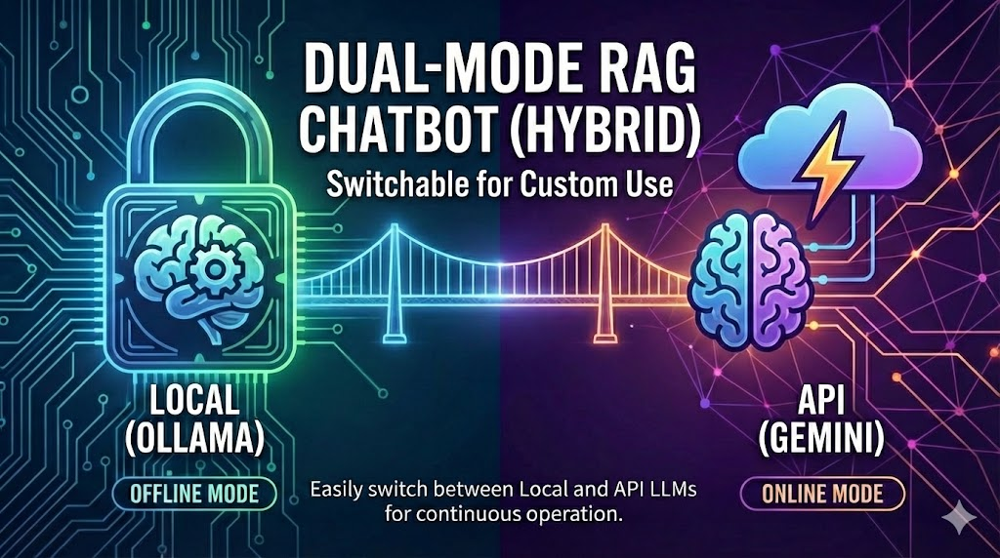
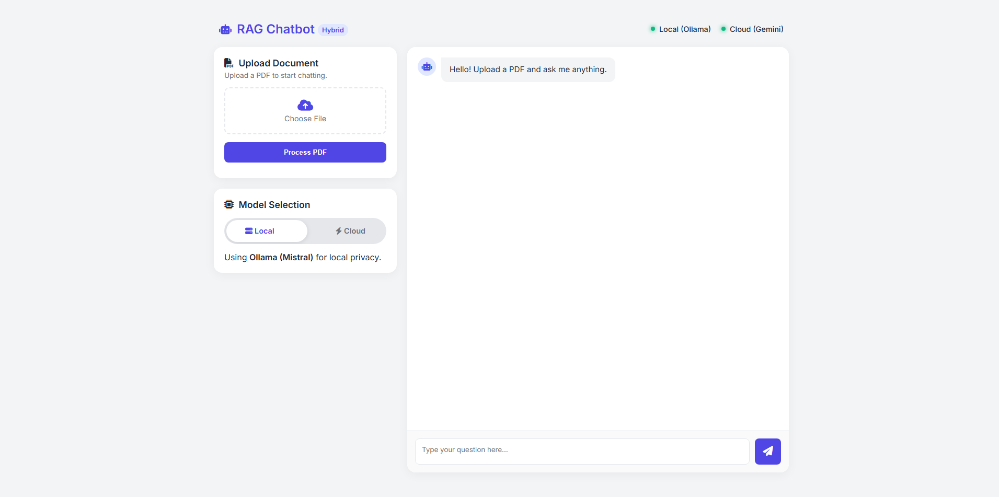
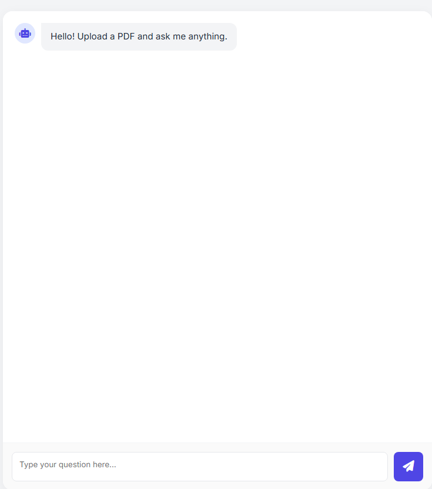
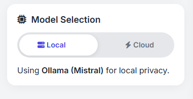
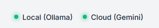

<br />
<div align="center">
  <a href="https://github.com/yourusername/Dual-Mode-RAG-Sys">
    
  </a>

  <h1 align="center">Dual-Mode RAG Chatbot (Hybrid)</h1>

  <p align="center">
    <b>Privacy when you need it. Power when you want it.</b>
    <br />
    A Hybrid RAG system toggling between Local Mistral (Ollama) and Cloud Gemini 1.5 Flash.
    <br />
    <br />
    <a href="https://github.com/yourusername/Dual-Mode-RAG-Sys/issues">Report Bug</a>
    ·
    <a href="https://github.com/yourusername/Dual-Mode-RAG-Sys/pulls">Request Feature</a>
  </p>
</div>

<div align="center">
  
  
  
  
  
</div>

<br />

<details>
  <summary><b>Table of Contents</b></summary>
  <ol>
    <li><a href="#-about-the-project">About The Project</a></li>
    <li><a href="#-screens--demo">Screens & Demo</a></li>
    <li><a href="#-key-features">Key Features</a></li>
    <li><a href="#-tech-stack">Tech Stack</a></li>
    <li><a href="#-getting-started">Getting Started</a></li>
    <li><a href="#-usage">Usage</a></li>
    <li><a href="#-roadmap">Roadmap</a></li>
    <li><a href="#-contributing">Contributing</a></li>
    <li><a href="#-license">License</a></li>
    <li><a href="#-contact">Contact</a></li>
  </ol>
</details>

---

## 🤖 About The Project

I built this project to solve the dilemma between data privacy and model performance. Many RAG systems force you to choose one: send your private data to the cloud OR suffer slow, lower-quality responses locally.

**Dual-Mode RAG Sys** gives you the best of both worlds. It processes documents locally using Qdrant and LangChain, but gives the user a simple toggle switch to decide who answers the question:

* 🔒 **Local Mode:** Uses Mistral (via Ollama) running entirely on your machine. Zero data leaves your network.
* ⚡ **Cloud Mode:** Uses Gemini 1.5 Flash for complex reasoning and faster responses when privacy is less critical.

---

The "dilemma" refers to the difficult trade-off developers and companies currently face when building AI applications involving sensitive data (like personal financial records, medical history, or proprietary company secrets).

Here is the breakdown of the two conflicting choices:

1. The "Performance" Choice (Cloud AI) To get the smartest answers, complex reasoning, and fastest speeds, you typically have to use big Cloud models like GPT-4 or Gemini.

Pro: Extremely smart, fast, and easy to use.

Con: You must send your private PDF data to Google or OpenAI's servers to get an answer. For many companies, this is a security violation.

2. The "Privacy" Choice (Local AI) To keep data 100% secure, you run the AI on your own laptop (like Ollama/Mistral). No data ever leaves your WiFi.

Pro: 100% Private. Secure.

Con: Usually dumber (hallucinates more), slower (burns your CPU/GPU), and struggles with complex instructions compared to Cloud AI.

The Solution (This Project): Your Dual-Mode RAG System solves this by not forcing the user to pick just one forever. They can toggle:

Is this a public news article? -> Switch to Cloud for maximum intelligence.

Is this my bank statement? -> Switch to Local for maximum privacy.

---

## 📸 Screens & Demo

Here is the application in action. The UI features a modern glassmorphism design with real-time status indicators.

| **Home Interface** | **Chat Experience** |
|:---:|:---:|
|  |  |
| *Clean upload & mode selection* | *Smart "Thinking" bubbles & rich text* |

| **Model Selection** | **Status** |
|:---:|:---:|
|  |  |
| *Clean upload & mode selection* | *Smart "Thinking" bubbles & rich text* |

> *Note: The status bar (top right) updates in real-time to show if your Local (Ollama) or Cloud (Gemini) services are active.*

---

## ✨ Key Features

* **🎛 Hybrid Intelligence:** One-click switch between Local (Ollama) and Cloud (Gemini) models.
* **🧠 Smart Context Management:** Automatically wipes old context when a new PDF is uploaded to prevent hallucinations.
* **🎨 Glassmorphism UI:** A beautiful, responsive frontend with smooth animations and typing effects.
* **🚦 Live Health Check:** The system constantly pings your local and cloud engines to show "Red/Green" status lights.
* **⚡ Vector Search:** Uses **Qdrant** (Dockerized) for enterprise-grade vector storage.

---

## 🛠 Tech Stack

### Backend
*  **FastAPI** - High-performance API.
*  **LangChain** - RAG orchestration.
*  **Qdrant** - Vector Database.
*  **Ollama** - Local LLM Serving.

### Frontend
*  **HTML5 / CSS3** - Custom UI.
*  **Vanilla JS** - Async interactions.

---

## ⚙️ Getting Started

Follow these steps to get the project running on your local machine.

### Prerequisites
* **Python 3.9+**
* **Docker Desktop** (for Qdrant)
* **Ollama** (for Local Mode) -> [Download Here](https://ollama.com/)

### Installation

1.  **Clone the repository**
    ```bash
    git clone [https://github.com/pradyumnadigraskar/Dual-Mode-RAG-Sys.git](https://github.com/pradyumnadigraskar/Dual-Mode-RAG-Sys.git)
    cd Dual_Mode_RAG_Sys
    ```

2.  **Create a Virtual Environment**
    ```bash
    python -m venv venv
    # Windows:
    venv\Scripts\activate
    # Mac/Linux:
    source venv/bin/activate
    ```

3.  **Install Dependencies**
    ```bash
    pip install -r requirements.txt
    ```

4.  **Set up Environment Variables**
    Create a `.env` file in the root directory:
    ```env
    GEMINI_API_KEY=your_google_gemini_api_key_here
    QDRANT_URL=http://localhost:6333
    QDRANT_API_KEY=   # Leave empty for local docker
    ```

5.  **Start the Database**
    ```bash
    docker-compose up -d
    ```

6.  **Prepare Local Model**
    ```bash
    ollama pull mistral
    ollama serve
    ```

---

## 🏃 Usage

1.  **Start the Server**
    ```bash
    uvicorn app.main:app --reload
    ```
2.  **Open Browser:** Go to `http://127.0.0.1:8000`
3.  **Upload PDF:** Click "Process PDF" and wait for the green checkmark.
4.  **Toggle Mode:** Use the switch to choose privacy (Local) or power (Cloud).
5.  **Chat:** Ask questions about your document!

---

## 🗺 Roadmap

- [x] Basic RAG Pipeline with Qdrant
- [x] Dual-Mode Switching (Ollama/Gemini)
- [x] UI/UX Overhaul (Glassmorphism)
- [x] Live Health Check System
- [ ] Add Chat History persistence
- [ ] Support for Docx and Txt files
- [ ] Dockerize the full stack

---

## 🤝 Contributing

Contributions are what make the open-source community such an amazing place to learn, inspire, and create. Any contributions you make are **greatly appreciated**.

1.  Fork the Project
2.  Create your Feature Branch (`git checkout -b feature/AmazingFeature`)
3.  Commit your Changes (`git commit -m 'Add some AmazingFeature'`)
4.  Push to the Branch (`git push origin feature/AmazingFeature`)
5.  Open a Pull Request

---

## 📄 License

Distributed under the MIT License. See `LICENSE` for more information.

---

## 📞 Contact

**Pradyumna Digraskar** 📧 Email:pradyumnadigraskar11@gmail.com 
🔗 LinkedIn: https://linkedin.com/in/pradyumnadigraskar  
📂 Project Link: [https://github.com/pradyumnadigraskar/Dual-Mode-RAG-Sys](https://github.com/pradyumnadigraskar/Dual-Mode-RAG-Sys)

<p align="center">
  
</p>
